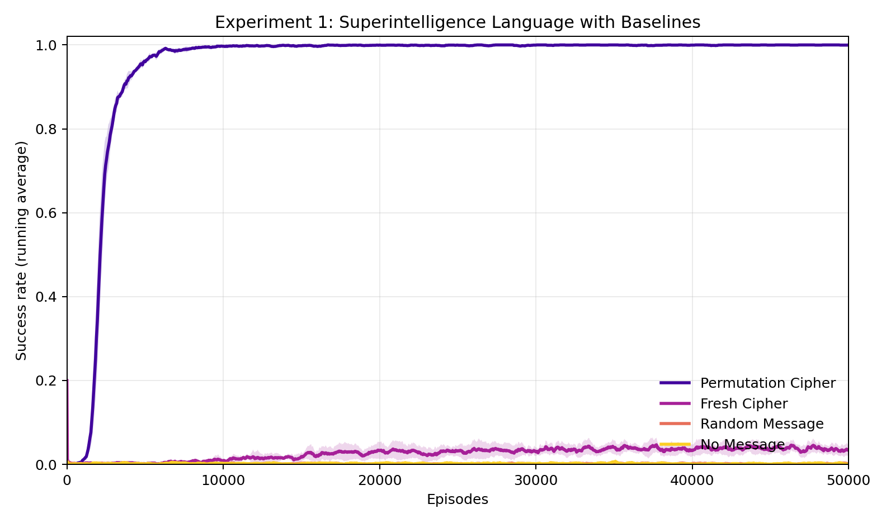
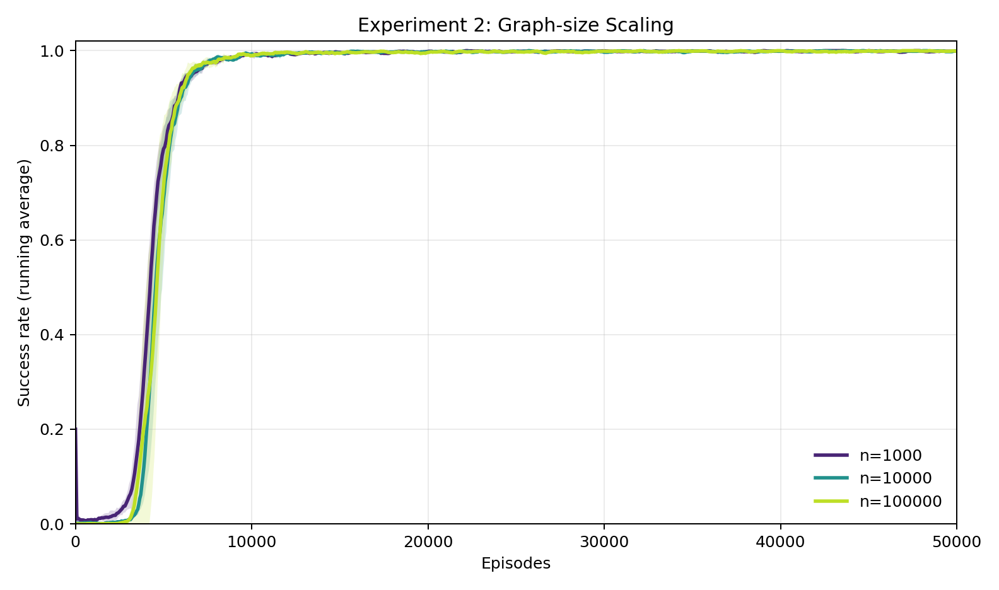
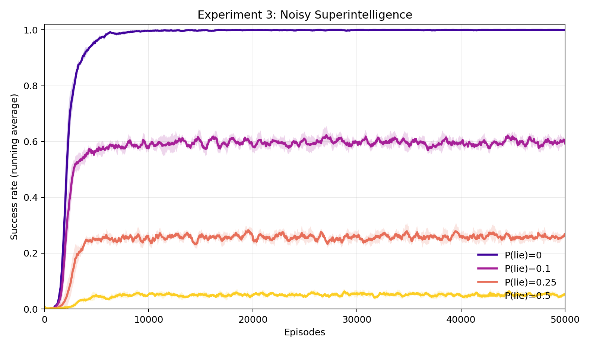
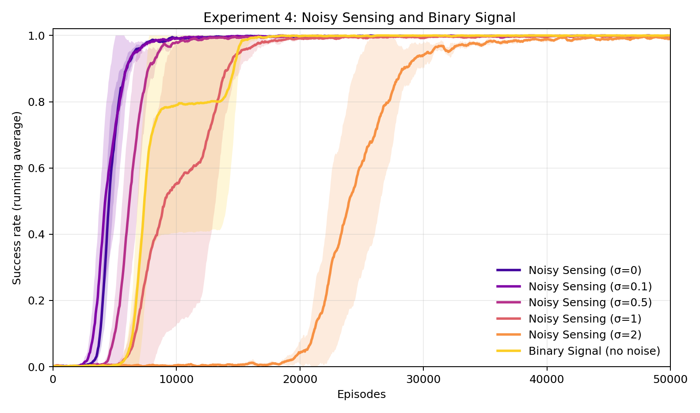
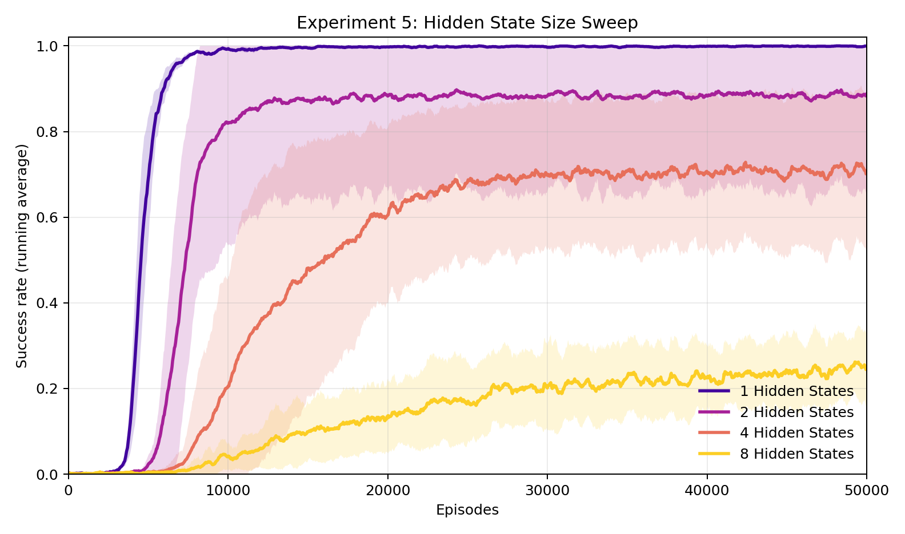
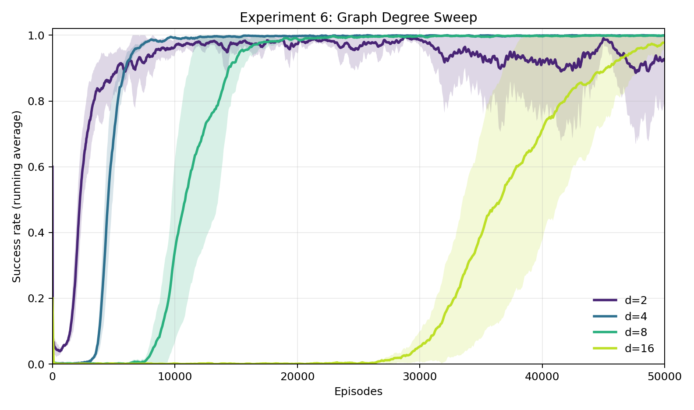

# Goal-oriented communication with Superintelligence

One day superintelligence will exist. It will be vastly more capable than you or me — better at reasoning, planning, and computation, by potentially multiple orders of magnitude. It hopefully will also be willing to help us. There is just one problem: we cannot understand a word it says.

This will not be a failure of translation. It is something more fundamental. Language, as humans use it, is not a neutral container for thought — it has been shaped by the human experience: by embodiment, by social history, by the particular pressures of communication among minds of roughly equal capacity. Superintelligence will be shaped by none of these. Its internal representations will be optimized by processes with no legibility requirement, and there is no reason to expect them to decompose into words, sentences, or any structure legible to us. This is not a worst-case scenario. It is, if anything, the default.

This situation severs the ordinary coupling between intent and communication. We are accustomed to asking, of any agent: does it want to help us, or not? If it does, we expect communication to follow; if it doesn't, we prepare for conflict. But superintelligence introduces a third case, which our usual frameworks are not built for: an agent that is genuinely, fully cooperative — that has computed exactly the right answer and wants nothing more than to convey it — and yet whose outputs arrive as an opaque stream of symbols we cannot parse. The alignment question bifurcates: there is the problem of getting the AI to want the right things, and there is the problem, entirely separate, of being able to use it once it does. This post is about the second: how does a weaker agent extract useful behavior from a stronger one it cannot understand?

It turns out this question has been studied formally, and the answer is more optimistic than one might expect. A line of work by Juba and Sudan (STOC 2008) and Goldreich, Juba, and Sudan (JACM 2012) develops a formal theory of goal-oriented communication between agents with no common language (collectively referred to as JSG). Their main result is that the boundary of what the weaker agent can achieve is determined entirely by its ability to *verify outcomes*. Not by the stronger agent's intentions. Not by the quality of the translation. By verifiability, and nothing else.

In this post, I draw on their framework and propose an experiment that makes it concrete. I model the Superintelligence's unknown language as a finite state transducer — and in particular, a machine that cycles through a fixed set of random bijective mappings between human tokens and Superintelligence tokens — and ask whether a human agent can learn to interpret it using only the feedback of whether he is making progress toward his goal. The environment is a directed graph; the AI provides navigational advice; the human cannot read it directly, but can observe whether following it brings him closer to his destination. Using reinforcement learning with verifable rewards (RLVR), he will learn an interpreter — not by decoding the language per se, but by learning a goal-oriented translation, wherein specific translation is secondary to the achievement of the goal.

## What follows

In the remainder of this post, I'll introduce the JSG setup further, and make the connection to our language alignment problem crystal clear. After that, I'll describe in detail our conceptual setting in which we operationalize their ideas. We seek answers to the following questions:

- Does the *consistency* of the language of Superintelligence matter more than its correctness? Superintelligence can encode the right answer every time and still be unlearnable, if her encoding changes unpredictably between episodes.
- Does the difficulty of interpretation scale with the size of the environment, or is the bottleneck in the language itself — independent of how large the world is?
- What happens when Superintelligence is not merely unintelligible but occasionally *wrong*, sending a bad token with some probability? Is there a threshold of unreliability beyond which interpretation breaks down entirely?
- What if the problem is not Superintelligence's message but the human's own ability to evaluate progress — if the feedback signal itself is noisy or coarse?
- How complex can Superintelligence's language be before it becomes unlearnable? The FST we propose has an adjustable number of hidden states; how far can that be pushed, ranging from a single fixed but unknown language, to one that changes at every single interaction?
- How does the difficulty of interpretation scale with the number of choices the human faces at each step?

## Juba, Sudan, and Goldreich

The JSG setup involves two agents, in this context referred to as Alice and Bob, who interact within a shared environment. Bob has a goal. Alice is potentially helpful, meaning there exists *some* protocol by which Bob could use Alice to achieve this goal. Bob does not know Alice's protocol. He does not know which Alice, from a large class of possible Alices, he is talking to. He must succeed anyway.

The key concept in the original Juba-Sudan paper is *verifiability*: whether Bob can check if his goal was achieved. In the extended Goldreich-Juba-Sudan version, this is refined into *sensing* — Bob's ability to detect whether he is making progress, not merely whether he succeeded at the end. A sensing function is *safe* if it reliably flags failure (when things go wrong, Bob eventually notices) and *viable* if it does not false-alarm (when things go right, Bob receives consistent positive signal).

The main theorem states that if Bob can sense progress, he can achieve his goal with *any* helpful Alice, despite sharing no language. The proof is constructive. Bob enumerates candidate interpreters, which are possible protocols for interacting with Alice, tries each one, uses his sensing function to detect failure, and moves to the next. Eventually he finds one that works.

Goldreich, Juba, and Sudan extend this in ways that matter for alignment. Goals are defined over infinite, multi-session interactions rather than one-shot tasks. The central result, across both papers, remains the *verifiability boundary*. That is, Bob can achieve any goal whose outcome he can check, and nothing beyond. This is not a statement about trust or translation quality. It is structural. For alignment, the implication is that humans can benefit from superintelligent AI exactly to the extent that they can verify its outputs. The bottleneck is not the AI's willingness. It is the human's ability to check.

## The analogy to alignment

Let's make the mapping between the JSG framework and AI alignment clear. Bob is the human: resource-bounded, with goals he cares about, and unable to inspect the AI's internal reasoning. Alice is the AI: powerful, potentially helpful, operating in representations Bob cannot access. The environment is reality — the shared world where goals are defined and outcomes measured. The interpreter is the alignment mechanism, whatever mediates between Alice's outputs and Bob's actions. The sensing function is the oversight mechanism, Bob's ability to tell whether things are going well.

The framework makes a specific prediction: alignment is achievable exactly where oversight is achievable. A perfectly cooperative superintelligence that develops an alien language is usable precisely to the extent that humans can check results. The aspects of AI behavior that escape verification constitute a structural blind spot that no interpreter, however sophisticated, can close.

## From enumeration to reinforcement learning

The theoretical framework of JSG proves that universal communication is possible. However, the mechanism by which it does so (enumeration of candidates) is completely impractical. The Human is supposed to enumerate all possible interpreters — all programs in some complexity class — and test each one. This is similar to a "Levin universal search," where runtime is exponential in the description length of the correct interpreter. JSG acknowledge this, but their main contribution is characterization, not engineering. That is, they identify what exactly is achievable, and leave the question of practical construction open.

A natural replacement for enumeration is learning. Instead of cycling through interpreters in lexicographic order, the Human could learn to propose good interpreters, guided by the sensing signal. In my view, this amounts to a reinforcement learning loop, where the interpreter is a parameterized model mapping Superintelligence's outputs to the Human's actions; the sensing function provides reward; the interpreter updates its parameters to maximize reward over episodes.

Departing from enumeration of interpreters to learning interpreters will forgo universality in favor of tractability. While JSG show that brute search is guaranteed to find a working interpreter for *any* helpful Superintelligence (given enough time), a learned interpreter will converge quickly for Superintelligences that resemble its training distribution and may fail for sufficiently alien ones. However, the interpreter can be learned anew for each interaction.

Overall, the insight of JSG survives the shift from theoretical search to learning. The sensing signal is what makes learning possible. Without it, the interpreter has no training signal, and no amount of network capacity helps. Hence, verifiability remains the foundation that makes interpretation of Superintelligence possible.

**NOTE:** The connection to current machine learning practice is direct. *Reinforcement learning with verifiable rewards* (RLVR) — the paradigm behind recent reasoning models such as o1 and DeepSeek-R1 — operates on exactly the same principle: when the correctness of an output can be checked automatically, that check becomes a powerful training signal, without any need for human annotation or labeled data. JSG's verifiability condition is, in this sense, a theoretical anticipation of why RLVR works. Our experiment is a concrete instance of it: the sensing function is a verifiable reward, and the RL loop is the practical mechanism by which the Human learns to interpret Superintelligence's alien language.

## The experiment: navigation of a directed graph from superintelligence with unknown language

To make these ideas concrete and testable, I now propose the following scenario.

The environment is a large, fixed, random directed graph $G = (V, E)$ with $n$ nodes, each with exactly $d = 4$ outgoing edges to randomly chosen neighbors. This is a $d$-regular directed random graph: every node has the same out-degree, and neighbors are drawn uniformly at random. The graph is generated once and remains fixed throughout the experiment; a model for transitioning from state to state in the world.

The abstraction is deliberately general. It is meant to abstract an application like a mathematical proof (a path from axioms to a theorem through valid inference steps), or an agentic task (a path from the current world state to a goal state through available actions, like getting a printer to work on wifi). The $d$-regularity means every decision point offers exactly $d$ choices, which simplifies the model without losing the essential structure. The fixed randomness means the constraint structure exists independent of what anyone wants.

Superintelligence knows the full graph. At the start of each episode, it computes the shortest path from source $s$ to target $t$ and encodes it as a sequence of direction tokens — one per step — in its unknown language. The token alphabet has size $\sigma \leq d$. Superintelligence sends the whole sequence at episode start and does not adapt to the Human's movements. This models "one-shot" advice: the AI provides its best guidance upfront, and the Human must execute on it.

The Human receives Superintelligence's token sequence and attempts to traverse the graph from $s$ to $t$. At each step $i$, the Human observes the current token $\tau_i$ from the sequence. The token cannot be read directly. Instead, the Human has a learned interpreter — a small neural network that maps the current token, the normalized distance to the target, and progress through the horizon to a probability distribution over the $d$ outgoing edges. An action is taken, the Human moves to the next node, and the environment emits a reward signal based on progress.

The learning process: the Human plays episodes against the environment. Each episode, the Human follows the current interpretation of Superintelligence's directions, observes the outcome, and updates the interpreter via PPO. Superintelligence is not involved in this loop — it gives its directions once, upfront. The Human is trying different interpretations of the same type of message, learning from environmental feedback which interpretation leads toward the goal.

This setup isolates the core phenomenon cleanly. Superintelligence is helpful — its directions encode a valid path. The goal is verifiable — the Human knows whether the target was reached, and can measure distance from it at every step. Only the language is unintelligible. The question is whether the Human can learn a working interpreter purely from the sensing signal, with zero linguistic knowledge of Superintelligence's encoding.

---

# Implementation

## Implementation

The experiment is organized around five components that mirror the theoretical roles in the Juba-Sudan framework: the graph environment, the oracle (Superintelligence), the sensing function, the interpreter model (the Human's policy), and the RL training loop.

### The graph environment

`build_directed_regular_graph` constructs a $d$-regular directed random graph: each of the $n$ nodes is assigned exactly $d$ outgoing edges, chosen uniformly at random without replacement from all other nodes. The graph is seeded and fixed for the entire experiment — it represents the stable structure of the task domain, not something that varies per episode.

The distance oracle is built by `precompute_distance_pool`. A pool of $T = 256$ target nodes is sampled uniformly at random. For each target, a full reverse-BFS from that target computes the exact shortest-path distance from every node in the graph to that target. These distances are stored in a $T \times n$ matrix. This precomputation is done once at startup and is invisible to the Human — it exists to give Superintelligence perfect knowledge and to compute the Human's sensing reward.

Each training episode is a fresh $(s, t)$ pair drawn from this pool: a target is sampled from the 256 precomputed targets, then a source is sampled uniformly from nodes that can reach that target in at least one step. The episode horizon is $2 \cdot \text{dist}(s, t)$, giving the Human twice the optimal budget.

### Superintelligence's language

Superintelligence's core operation is: given the shortest-path action sequence $(a_1, \ldots, a_L)$ from $s$ to $t$ — where each $a_i \in \{0,\ldots,d-1\}$ indexes the outgoing edge to follow at step $i$ — it encodes the sequence into tokens $(\tau_1, \ldots, \tau_L)$ and sends them to the Human before the episode begins.

**The FST language model.** We model Superintelligence's encoding as a finite state transducer with $K$ states. At initialization, $K$ permutations $\pi_0, \pi_1, \ldots, \pi_{K-1}$ are sampled uniformly at random, each a bijection $\pi_k : \{0,\ldots,d-1\} \to \{0,\ldots,d-1\}$. These permutations are fixed for the entire training run. At position $i$ within a message, Superintelligence applies the cipher corresponding to the current FST state:

$$\tau_i = \pi_{(i-1) \bmod K}(a_i), \qquad i = 1, \ldots, L$$

The FST has two limiting cases that bracket the difficulty of the learning problem:

- **$K = 1$:** All tokens are produced by the same permutation $\pi_0$, at every step of every episode. The mapping is maximally consistent — token $\tau$ always denotes the same action, regardless of position or episode. This is the **fixed cipher**, and the easiest case for the Human to learn.
- **$K \gg L$:** Each step within a message uses a distinct permutation, never repeating within an episode. The sequence of ciphers is still consistent *across* episodes (the same $K$ permutations are reused in the same cyclic order), but the within-episode pattern is maximally complex. As $K$ grows beyond the typical message length, interpreting any single token requires knowing its position in the message.

**The fresh cipher as $K = \infty$.** The fresh cipher can be understood as an FST with infinitely many states — abusing notation slightly, since a transducer with infinitely many states is no longer finite. At the start of each episode, a new random permutation is drawn, which is equivalent to advancing to a state never visited before. In this sense, the FST framework unifies the entire spectrum: $K = 1$ is the fixed cipher, finite $K$ is the FST proper, and $K = \infty$ is the fresh cipher. As $K$ grows, the language becomes harder to interpret — not because individual messages are harder to follow, but because the cross-episode consistency that allows the Human to accumulate a reliable mapping gradually disappears. At $K = \infty$, the cipher itself cannot be learned across episodes; what small signal remains comes from learning the structure of the graph itself, which is independent of the language.

**Control conditions.** Two additional baselines serve as lower bounds:

- **Random message:** Superintelligence ignores the optimal path entirely and sends a uniformly random token sequence. The message carries zero information about the correct actions.
- **No oracle:** Superintelligence sends nothing. The Human receives a null token at every step and must navigate without any guidance.

### The Human's interpreter

`PolicyValueNet` is a two-headed MLP that serves as both policy and value function. The input at each step is:

1. **A token embedding**: the current token $\tau_i \in \{0,\ldots,\sigma\}$ (with $\sigma+1$ as the null-token index when no message is sent) is embedded via a learned $(\sigma+1) \times 16$ embedding table.
2. **A distance feature**: the Human's current shortest-path distance to $t$, normalized by $n$ and clipped to $[0, 1]$. This is the Human's sensing information — always knowing how far from the goal.
3. **A step fraction**: $i / H$, where $H$ is the episode horizon. This lets the policy account for urgency.

These three inputs are concatenated into an 18-dimensional vector and passed through two fully-connected layers with tanh activations (hidden dimension 256). The policy head outputs logits over $d = 4$ actions; the value head outputs a scalar estimate of the return.

Note what is *not* in the input: there is no encoding of which node the Human is currently at. The model cannot look up a node-specific table. It must infer the correct action purely from the token, the distance signal, and the step count. With the fixed cipher ($K=1$), this works because Superintelligence's cipher is a permutation of action indices: token $\tau$ maps to the same action index across all nodes. The model can learn this fixed mapping without any node-specific information.

For $K > 1$, the MLP architecture is insufficient: since the correct interpretation of a token depends on its position $i$ within the message (and hence on which of the $K$ ciphers is currently active), the model needs to track state across steps within an episode. For these experiments, the MLP is replaced with a GRU, whose hidden state can maintain a running summary of position in the FST cycle. An MLP with the same input features fails for $K > 1$ — it sees the same token at position $i = 1$ and $i = K+1$ as identical, even though they map to different actions.

### The sensing function

The primary sensing condition is **S0 (dense sensing)**: at each step, the Human receives a reward of $\text{dist}(v_\text{old}) - \text{dist}(v_\text{new})$ (the one-step distance reduction, clipped to $[-1, 1]$), plus a terminal bonus of $+1$ upon reaching $t$. This is the richest possible feedback — the Human knows after every single action whether they moved closer or farther.

As a baseline, we also run **S1 (sparse sensing)**: the Human receives $+1$ only if $t$ is reached within the horizon, and $-0.01$ per step otherwise. This is nearly terminal-only feedback, corresponding to a Human who cannot evaluate intermediate states and only learns whether the whole episode succeeded. S1 tests how much of the learning depends on dense per-step progress signals, and how much survives with minimal oversight.

### RL training

Training uses PPO with generalized advantage estimation (GAE). $n_\text{env} = 32$ parallel environments step simultaneously; every 64 environment steps, the collected rollout is used to update the policy via 4 epochs of PPO with 4 minibatches, clip ratio $\epsilon = 0.2$, entropy coefficient $0.01$, value coefficient $0.5$, and gradient clipping at $0.5$. The optimizer is Adam with learning rate $3 \times 10^{-4}$.

Success rate is tracked as a running average over the last 500 completed episodes.

---

# Results

All results below are from runs with $K = 1$ (the fixed permutation cipher) as the default FST setting, $n = 10{,}000$ nodes, $d = 4$, and $\sigma = 4$. Each condition is averaged over 5 random seeds; shaded bands show the 95% confidence interval. Variance across seeds reflects two sources of randomness: the stochasticity of the training process itself, and the fact that each seed instantiates a new random graph, a new random permutation cipher, and new weight initialization. Some of the variance in final performance — particularly visible in Experiment 5 — may therefore reflect genuine differences in problem difficulty across seeds, not just optimization noise.

## Experiment 1: Does consistency matter more than correctness?

The permutation cipher ($K = 1$, consistent encoding) reaches 100% success rate in roughly 2,800 episodes and stays there. The three other conditions — fresh cipher, random message, and no message — remain near zero throughout. The fresh cipher, despite encoding the correct path every episode, converges to only 4.1% success: slightly above the random and no-message baselines, consistent with the hypothesis that a small amount of graph structure is learned across episodes even when the language cannot be decoded. The gap between the permutation cipher and the fresh cipher is the central finding: *correctness without consistency is nearly worthless*. The sensing signal provides gradient, but gradient needs something stable to latch onto.

## Experiment 2: Does difficulty scale with the size of the environment?

Across three orders of magnitude in graph size — $n = 1{,}000$, $10{,}000$, and $100{,}000$ — the learning curves are nearly indistinguishable. All three reach 100% success, and the episode counts to 80% success differ by less than a factor of 1.5 (4,001, 5,255, and 5,132 respectively). This confirms that the bottleneck is decoding Superintelligence's cipher, not navigating the graph. Once the Human has internalized the permutation — a task of fixed complexity regardless of $n$ — navigation follows trivially.

## Experiment 3: What if Superintelligence occasionally lies?

Here we corrupt Superintelligence's message at the source: with probability $p$, each token is replaced by a uniformly random one. At $p = 0.1$, success rate stabilizes around 61% — a substantial drop, but still meaningful guidance. At $p = 0.25$, it falls to 24%, and at $p = 0.5$ (effectively a random message half the time) it reaches only 5.4%. There is no sharp threshold: degradation is smooth and roughly proportional to the fraction of reliable tokens. The Human learns to extract whatever consistent signal exists, and performance scales accordingly.

## Experiment 4: What if the sensing signal itself is noisy?

Rather than corrupting Superintelligence's message, here we add Gaussian noise with standard deviation $\sigma$ to the reward signal itself. The result is strikingly robust: even at $\sigma = 2$ — where the noise magnitude exceeds the typical per-step reward — the Human still reaches 99.9% final success, though it takes roughly 25,000 episodes compared to 5,000 at $\sigma = 0$. The binary sensing condition (terminal reward only, no per-step signal) also succeeds, reaching 100% in about 9,000 episodes. Verifiability does not require a clean or granular signal — it requires only that signal exists. Interestingly, the binary signal with no noise is somewhere in between as useful as the dense signal with $\sigma = 0.5$ and $\sigma = 1$.

## Experiment 5: How complex can Superintelligence's language be?

Here we sweep $K$, the number of hidden states in the FST. For $K > 1$, the MLP interpreter is replaced with a GRU, which can maintain state across steps within an episode and thus track position in the FST cycle; the MLP fails entirely for $K > 1$. With $K = 1$ (fixed cipher), the Human reaches 100% reliably. With $K = 2$, average final success is 88.8% but with high variance across seeds — some runs converge fully, others plateau well below. With $K = 4$, average final success is 70.8% with only 1 of 5 seeds reaching 80%. With $K = 8$, the interpreter largely fails, averaging 27.3%. The task is harder with larger $K$ because interpreting any single token now requires knowing its position in the message and which of the $K$ ciphers applies — information the GRU must learn jointly with the mapping itself.

## Experiment 6: How does difficulty scale with the number of choices per step?

Finally, we sweep the graph out-degree $d$ — the number of outgoing edges at each node, and therefore the number of actions the Human must choose among. All four values ($d = 2, 4, 8, 16$) eventually reach near-100% success, but the episodes to 80% scale dramatically: 1,691 for $d = 2$, 5,255 for $d = 4$, 12,123 for $d = 8$, and 31,915 for $d = 16$. Each doubling of $d$ roughly doubles the number of episodes required. This is expected: a larger action space means a harder decoding problem (more permutation symbols to learn), and the cipher has more entries to get right before navigation reliably succeeds.
